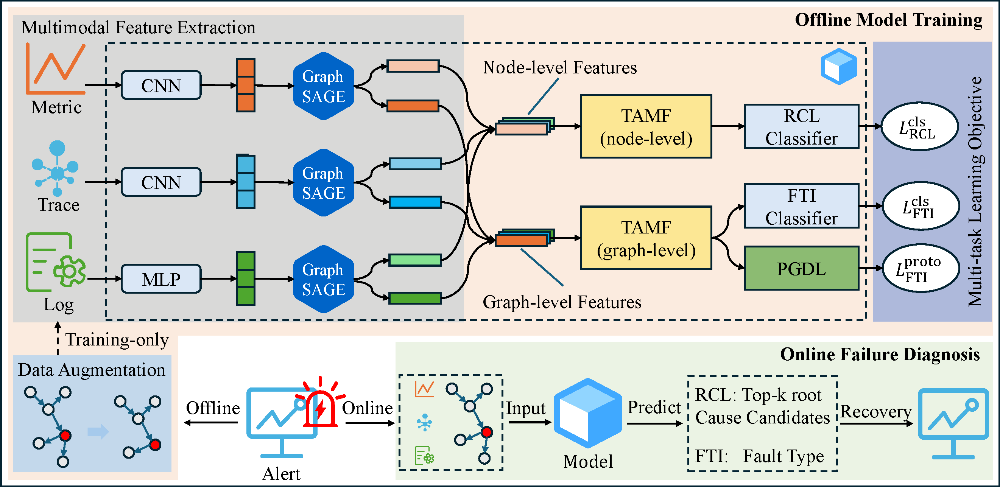

## TaskProto: Task-Adaptive Multimodal Fusion with Prototype-Guided Learning for Microservice Fault Diagnosis

[](#license)

This repository provides the **official implementation** of **TaskProto**, an end-to-end multimodal microservice fault diagnosis framework for Root Cause Localization (RCL) and Fault Type Identification (FTI).



---

## Project Structure

```text
TaskProto/
├── main.py                          # Entry point (train + evaluate)
├── config/
│   └── exp_config.py                # Experiment configuration (paths + hyperparams)
├── core/
│   ├── MultiModalDiag.py            # Training / evaluation pipeline
│   ├── loss/                        # Loss functions (e.g., contrastive, AWL)
│   ├── model/                       # Model components (encoders, fusion, heads)
│   └── multimodal_dataset.py        # Dataset wrapper for DGL graphs
├── process/
│   └── DatasetProcess.py            # Load dataset.pkl and build graph datasets (+ augmentation)
├── preprocess/
│   ├── gaia/                        # Gaia preprocessing pipeline
│   ├── sn/                          # SN preprocessing pipeline
│   └── tt/                          # TT preprocessing pipeline
├── scripts/
│   └── convert_timezone_to_utc.py   # Timestamp alignment for SN/TT raw data
├── utils/                           # Utilities (evaluation, early stop, Drain, etc.)
├── data/
│   ├── raw_data/                    # Optional: raw datasets (downloaded by user)
│   └── processed_data/              # Generated model inputs (dataset.pkl, graphs, templates)
├── LICENSE
├── requirements.txt
└── README.md
```

## Quick Start

**Python**: `3.10.19`

### 1) Install dependencies

```bash
## Install PyTorch + DGL
# CUDA 11.8 example:
pip install torch==2.1.1 torchvision==0.16.1 torchaudio==2.1.1 --index-url https://download.pytorch.org/whl/cu118
pip install dgl -f https://data.dgl.ai/wheels/cu118/repo.html

# CUDA 12.1 example:
# pip install torch==2.1.1 torchvision==0.16.1 torchaudio==2.1.1 --index-url https://download.pytorch.org/whl/cu121
# pip install dgl -f https://data.dgl.ai/wheels/cu121/repo.html
```

```bash
pip install -r requirements.txt
```

### 2) Run

If `data/processed_data/<dataset>/dataset.pkl` is present, you can run training/evaluation directly:

```bash
python main.py --dataset gaia --gpu 0
python main.py --dataset sn --gpu 0
python main.py --dataset tt --gpu 0
```

---

## Data & Preprocessing (Optional)

Use this section only if you want to **download raw datasets** and **reproduce the preprocessing pipeline** (or understand how the inputs to the model are produced).

### SN / TT raw datasets

Download SN/TT from [Zenodo (TaskProto dataset)](https://zenodo.org/records/18859856), then place the zip files under `TaskProto/data/raw_data/`:

- `SN_Dataset.zip`
- `TT_Dataset.zip`

#### (Optional) Integrity check (MD5)

To ensure your download is **not corrupted** (and avoid silent preprocessing/training issues), this repo provides an MD5 manifest at `data/raw_data/sn_tt_checksums.md5` for the two zip files. Run from the repo root `TaskProto/`:

```bash
md5sum -c data/raw_data/sn_tt_checksums.md5
```

- **Success**: all lines end with `OK`.
- **Failure**: any line shows `FAILED` → re-download the corresponding zip and re-check.

#### 1) Unzip (rename folders to `sn` / `tt`)

Run from the repo root `TaskProto/`:

```bash
unzip -q "data/raw_data/SN_Dataset.zip" -d "data/raw_data" && mv "data/raw_data/SN Dataset" "data/raw_data/sn"
unzip -q "data/raw_data/TT_Dataset.zip" -d "data/raw_data" && mv "data/raw_data/TT Dataset" "data/raw_data/tt"
```

#### 2) Align timestamps (UTC)

```bash
python scripts/convert_timezone_to_utc.py
```

#### 3) Run preprocessing (generate `data/processed_data/<dataset>/dataset.pkl`)

SN:

```bash
python preprocess/sn/process_sn_label.py
python preprocess/sn/process_sn_metric.py
python preprocess/sn/process_sn_trace.py
python preprocess/sn/process_sn_log.py
python preprocess/sn/process_sn_graph.py --mode predefined_static
python preprocess/sn/process_sn_data.py
```

These steps will generate the files used by training, including:

- `data/processed_data/sn/dataset.pkl`
- `data/processed_data/sn/graph/nodes_predefined_static_no_influence.json`
- `data/processed_data/sn/graph/edges_predefined_static_no_influence.json`
- `data/processed_data/sn/drain_models/sn_templates.csv`

TT:

```bash
python preprocess/tt/process_tt_label.py
python preprocess/tt/process_tt_metric.py
python preprocess/tt/process_tt_trace.py
python preprocess/tt/process_tt_log.py
python preprocess/tt/process_tt_graph.py --mode predefined_static
python preprocess/tt/process_tt_data.py
```

These steps will generate the files used by training, including:

- `data/processed_data/tt/dataset.pkl`
- `data/processed_data/tt/graph/nodes_predefined_static_no_influence.json`
- `data/processed_data/tt/graph/edges_predefined_static_no_influence.json`
- `data/processed_data/tt/drain_models/tt_templates.csv`

### Gaia dataset (MicroSS)

This project uses the **GAIA-DataSet (MicroSS)** as the raw data source for the `gaia` setting.

#### Download

Recommended (git):

```bash
git clone --branch release-v1.0 https://github.com/CloudWise-OpenSource/GAIA-DataSet.git
```

If you cannot download via `git clone`, download the release archive from the GitHub webpage and extract it locally:
[`CloudWise-OpenSource/GAIA-DataSet`](https://github.com/CloudWise-OpenSource/GAIA-DataSet).

GitHub provides the source archive in **two formats** (either is fine):

- **Source code (zip)**
- **Source code (tar.gz)**

In this repo, extract the archive under `data/raw_data/` and make sure you have a folder like:

- `data/raw_data/GAIA-DataSet-release-v1.0/`

#### (Optional) Integrity check (MD5)

To ensure your download/extraction is **not corrupted** (especially for split archives), this repo provides an MD5 manifest at `data/raw_data/checksums.md5` for **MicroSS** (83 entries).

Run the check inside the extracted `MicroSS/` directory (repo root `TaskProto/`):

```bash
cp data/raw_data/checksums.md5 data/raw_data/GAIA-DataSet-release-v1.0/MicroSS/
cd data/raw_data/GAIA-DataSet-release-v1.0/MicroSS && md5sum -c checksums.md5
```

**How to read the results**:

- **Success**: all lines end with `OK` → files are intact.
- **Failure**: any line shows `FAILED` → re-download the dataset (or that specific part) and re-check.

Example:

```bash
business/business_split.z01: OK
metric/metric_split.z01: OK
run/run.zip: OK
trace/trace_split.z01: OK
...
```

#### Extract split archives (MicroSS only)

GAIA (MicroSS) uses split zip archives (`.z01`, `.z02`, ..., `.zip`). On Ubuntu, install 7zip and extract the `.zip` in each folder:

```bash
sudo apt install -y p7zip-full
cd data/raw_data/GAIA-DataSet-release-v1.0/MicroSS/business && 7z x business_split.zip
cd ../metric && 7z x metric_split.zip
cd ../run && 7z x run.zip
cd ../trace && 7z x trace_split.zip
```

#### Place raw files for preprocessing (what this repo needs)

Only the **MicroSS** part is required for this repo’s `gaia` preprocessing.

After extraction, organize the final layout under `data/raw_data/gaia/` as:

```text
data/raw_data/gaia/
  ├─ business/   # CSVs
  ├─ metric/     # CSVs
  ├─ trace/      # CSVs
  └─ label_gaia.csv
```

Commands (repo root `TaskProto/`):

```bash
mkdir -p data/raw_data/gaia
cp -r data/raw_data/GAIA-DataSet-release-v1.0/MicroSS/business/business data/raw_data/gaia/business
cp -r data/raw_data/GAIA-DataSet-release-v1.0/MicroSS/metric/metric     data/raw_data/gaia/metric
cp -r data/raw_data/GAIA-DataSet-release-v1.0/MicroSS/trace/trace       data/raw_data/gaia/trace
```

#### Run preprocessing scripts (Gaia → `data/processed_data/gaia/`)

Run from the repo root `TaskProto/`:

```bash
python preprocess/gaia/process_gaia_label.py
python preprocess/gaia/process_gaia_metric.py
python preprocess/gaia/process_gaia_trace.py
python preprocess/gaia/process_gaia_log.py
python preprocess/gaia/process_gaia_graph.py --mode static
python preprocess/gaia/process_gaia_data.py
```

These steps will generate the files used by training, including:

- `data/processed_data/gaia/dataset.pkl`
- `data/processed_data/gaia/graph/nodes_static_no_influence.json`
- `data/processed_data/gaia/graph/edges_static_no_influence.json`
- `data/processed_data/gaia/drain_models/gaia_templates.csv`
